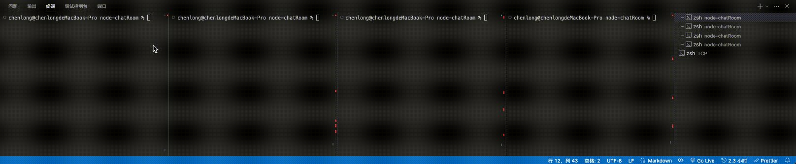

# node-chatRoom
基于tcp连接和基于终端的聊天室，包含聊天室上线，群发，私聊，退出等功能。
基于node中的net模块，纯原生js，学习过程中写的，如有错误，请指出。

# node server.js
启动tcp服务

# node client.js
客户端连接，可以同时启动多个客户端进行测试

# 运行方法
启动server.js，启动client.js
在clent中输入用户名，验证后开始连接
@用户名 私聊

# 效果图
